# dojinvoice_db

[](
  <https://badge.fury.io/py/dojinvoice-db>
) [](
  <https://github.com/eggplants/dojinvoice_db/actions/workflows/ci.yml>
)

[DLSite Dojinvoice](https://www.dlsite.com/maniax/works/voice) Database CLI

## Install

```bash
# mise
mise use -g pipx:dojinvoice-db

# pipx
pipx install dojinvoice-db

# pip
pip install dojinvoice-db
```

## CLI

```bash
dvdb crawl --full
dvdb crawl
dvdb details
dvdb refresh --stale-days 7
dvdb show RJ01234567
dvdb stats

dvdb crawl --sex-category male --sex-category female
dvdb crawl --work-type SOU --work-type MUS
```

## Schema

Regenerate with `mise run tbls`.

<!-- tbls:start -->
<!-- pyml disable-num-lines 1493 md013,md024,md033 -->
<details>
<summary>Database schema (generated by <code>tbls doc</code>)</summary>

### Description

SQLite database of DLsite doujin voice works

### Tables

| Name | Columns | Comment | Type |
| ---- | ------- | ------- | ---- |
| [work](#work) | 25 |  | table |
| [work_stat](#work_stat) | 13 |  | table |
| [work_stat_history](#work_stat_history) | 8 |  | table |
| [work_creator](#work_creator) | 3 |  | table |
| [work_genre](#work_genre) | 2 |  | table |
| [work_file_format](#work_file_format) | 2 |  | table |
| [work_event](#work_event) | 2 |  | table |
| [work_sample_image](#work_sample_image) | 3 |  | table |
| [fetch_error](#fetch_error) | 4 |  | table |
| [crawl_state](#crawl_state) | 2 |  | table |
| [work_full](#work_full) | 35 |  | view |

### Relations

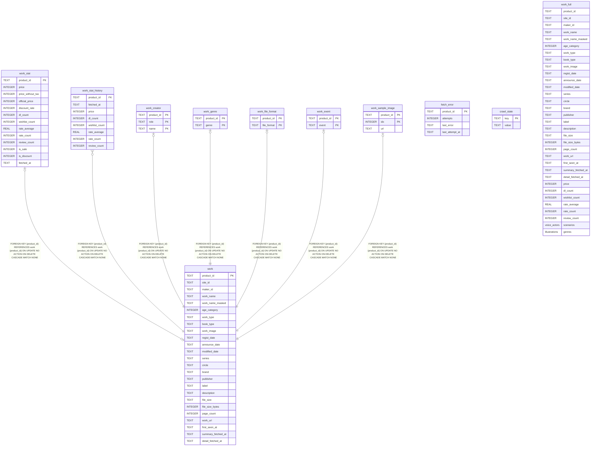

### work

#### Description

<details>
<summary><strong>Table Definition</strong></summary>

```sql
CREATE TABLE work (
    product_id         text primary key,
    site_id            text,
    maker_id           text,
    work_name          text not null,
    work_name_masked   text,
    age_category       integer,
    work_type          text,
    book_type          text,
    work_image         text,
    regist_date        text,
    announce_date      text,
    modified_date      text,
    series             text,
    circle             text,
    brand              text,
    publisher          text,
    label              text,
    description        text,
    file_size          text,
    file_size_bytes    integer,
    page_count         integer,
    work_url           text,
    first_seen_at      text not null,
    summary_fetched_at text,
    detail_fetched_at  text
)
```

</details>

#### Columns

| Name | Type | Default | Nullable | Children | Parents | Comment |
| ---- | ---- | ------- | -------- | -------- | ------- | ------- |
| product_id | TEXT |  | true | [work_stat](#work_stat) [work_stat_history](#work_stat_history) [work_creator](#work_creator) [work_genre](#work_genre) [work_file_format](#work_file_format) [work_event](#work_event) [work_sample_image](#work_sample_image) |  |  |
| site_id | TEXT |  | true |  |  |  |
| maker_id | TEXT |  | true |  |  |  |
| work_name | TEXT |  | false |  |  |  |
| work_name_masked | TEXT |  | true |  |  |  |
| age_category | INTEGER |  | true |  |  |  |
| work_type | TEXT |  | true |  |  |  |
| book_type | TEXT |  | true |  |  |  |
| work_image | TEXT |  | true |  |  |  |
| regist_date | TEXT |  | true |  |  |  |
| announce_date | TEXT |  | true |  |  |  |
| modified_date | TEXT |  | true |  |  |  |
| series | TEXT |  | true |  |  |  |
| circle | TEXT |  | true |  |  |  |
| brand | TEXT |  | true |  |  |  |
| publisher | TEXT |  | true |  |  |  |
| label | TEXT |  | true |  |  |  |
| description | TEXT |  | true |  |  |  |
| file_size | TEXT |  | true |  |  |  |
| file_size_bytes | INTEGER |  | true |  |  |  |
| page_count | INTEGER |  | true |  |  |  |
| work_url | TEXT |  | true |  |  |  |
| first_seen_at | TEXT |  | false |  |  |  |
| summary_fetched_at | TEXT |  | true |  |  |  |
| detail_fetched_at | TEXT |  | true |  |  |  |

#### Constraints

| Name | Type | Definition |
| ---- | ---- | ---------- |
| product_id | PRIMARY KEY | PRIMARY KEY (product_id) |
| sqlite_autoindex_work_1 | PRIMARY KEY | PRIMARY KEY (product_id) |

#### Indexes

| Name | Definition |
| ---- | ---------- |
| work_detail_pending_idx | CREATE INDEX work_detail_pending_idx on work (detail_fetched_at) |
| work_type_idx | CREATE INDEX work_type_idx on work (work_type) |
| work_maker_idx | CREATE INDEX work_maker_idx on work (maker_id) |
| work_regist_date_idx | CREATE INDEX work_regist_date_idx on work (regist_date desc) |
| sqlite_autoindex_work_1 | PRIMARY KEY (product_id) |

#### Relations

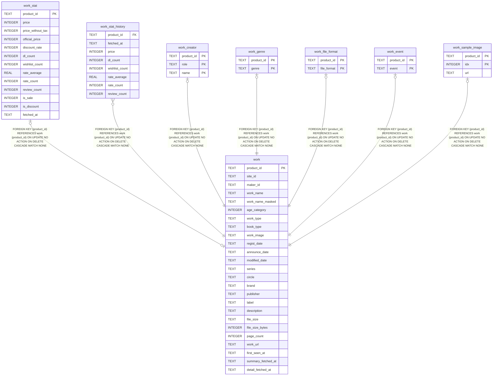

### work_stat

#### Description

<details>
<summary><strong>Table Definition</strong></summary>

```sql
CREATE TABLE work_stat (
    product_id        text primary key references work (product_id) on delete cascade,
    price             integer,
    price_without_tax integer,
    official_price    integer,
    discount_rate     integer,
    dl_count          integer,
    wishlist_count    integer,
    rate_average      real,
    rate_count        integer,
    review_count      integer,
    is_sale           integer,
    is_discount       integer,
    fetched_at        text not null
)
```

</details>

#### Columns

| Name | Type | Default | Nullable | Children | Parents | Comment |
| ---- | ---- | ------- | -------- | -------- | ------- | ------- |
| product_id | TEXT |  | true |  | [work](#work) |  |
| price | INTEGER |  | true |  |  |  |
| price_without_tax | INTEGER |  | true |  |  |  |
| official_price | INTEGER |  | true |  |  |  |
| discount_rate | INTEGER |  | true |  |  |  |
| dl_count | INTEGER |  | true |  |  |  |
| wishlist_count | INTEGER |  | true |  |  |  |
| rate_average | REAL |  | true |  |  |  |
| rate_count | INTEGER |  | true |  |  |  |
| review_count | INTEGER |  | true |  |  |  |
| is_sale | INTEGER |  | true |  |  |  |
| is_discount | INTEGER |  | true |  |  |  |
| fetched_at | TEXT |  | false |  |  |  |

#### Constraints

| Name | Type | Definition |
| ---- | ---- | ---------- |
| product_id | PRIMARY KEY | PRIMARY KEY (product_id) |
| - (Foreign key ID: 0) | FOREIGN KEY | FOREIGN KEY (product_id) REFERENCES work (product_id) ON UPDATE NO ACTION ON DELETE CASCADE MATCH NONE |
| sqlite_autoindex_work_stat_1 | PRIMARY KEY | PRIMARY KEY (product_id) |

#### Indexes

| Name | Definition |
| ---- | ---------- |
| sqlite_autoindex_work_stat_1 | PRIMARY KEY (product_id) |

#### Relations


### work_stat_history

#### Description

<details>
<summary><strong>Table Definition</strong></summary>

```sql
CREATE TABLE work_stat_history (
    product_id     text not null references work (product_id) on delete cascade,
    fetched_at     text not null,
    price          integer,
    dl_count       integer,
    wishlist_count integer,
    rate_average   real,
    rate_count     integer,
    review_count   integer
)
```

</details>

#### Columns

| Name | Type | Default | Nullable | Children | Parents | Comment |
| ---- | ---- | ------- | -------- | -------- | ------- | ------- |
| product_id | TEXT |  | false |  | [work](#work) |  |
| fetched_at | TEXT |  | false |  |  |  |
| price | INTEGER |  | true |  |  |  |
| dl_count | INTEGER |  | true |  |  |  |
| wishlist_count | INTEGER |  | true |  |  |  |
| rate_average | REAL |  | true |  |  |  |
| rate_count | INTEGER |  | true |  |  |  |
| review_count | INTEGER |  | true |  |  |  |

#### Constraints

| Name | Type | Definition |
| ---- | ---- | ---------- |
| - (Foreign key ID: 0) | FOREIGN KEY | FOREIGN KEY (product_id) REFERENCES work (product_id) ON UPDATE NO ACTION ON DELETE CASCADE MATCH NONE |

#### Indexes

| Name | Definition |
| ---- | ---------- |
| work_stat_history_idx | CREATE INDEX work_stat_history_idx on work_stat_history (product_id, fetched_at) |

#### Relations

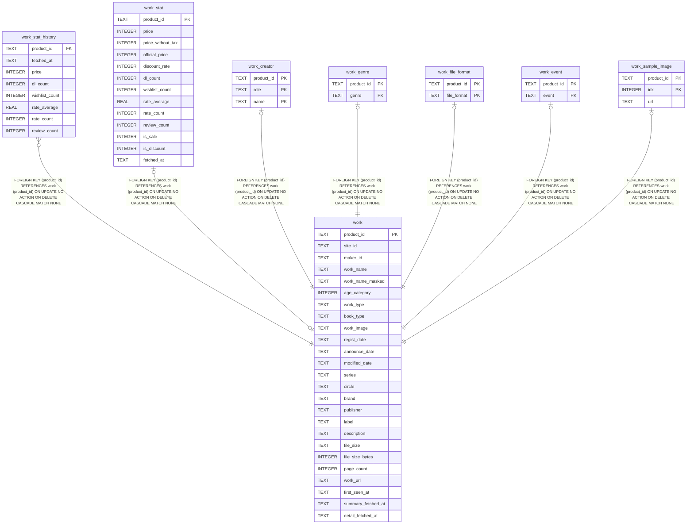

### work_creator

#### Description

<details>
<summary><strong>Table Definition</strong></summary>

```sql
CREATE TABLE work_creator (
    product_id text not null references work (product_id) on delete cascade,
    role       text not null,
    name       text not null,
    primary key (product_id, role, name)
)
```

</details>

#### Columns

| Name | Type | Default | Nullable | Children | Parents | Comment |
| ---- | ---- | ------- | -------- | -------- | ------- | ------- |
| product_id | TEXT |  | false |  | [work](#work) |  |
| role | TEXT |  | false |  |  |  |
| name | TEXT |  | false |  |  |  |

#### Constraints

| Name | Type | Definition |
| ---- | ---- | ---------- |
| product_id | PRIMARY KEY | PRIMARY KEY (product_id) |
| role | PRIMARY KEY | PRIMARY KEY (role) |
| name | PRIMARY KEY | PRIMARY KEY (name) |
| - (Foreign key ID: 0) | FOREIGN KEY | FOREIGN KEY (product_id) REFERENCES work (product_id) ON UPDATE NO ACTION ON DELETE CASCADE MATCH NONE |
| sqlite_autoindex_work_creator_1 | PRIMARY KEY | PRIMARY KEY (product_id, role, name) |

#### Indexes

| Name | Definition |
| ---- | ---------- |
| work_creator_name_idx | CREATE INDEX work_creator_name_idx on work_creator (name) |
| sqlite_autoindex_work_creator_1 | PRIMARY KEY (product_id, role, name) |

#### Relations

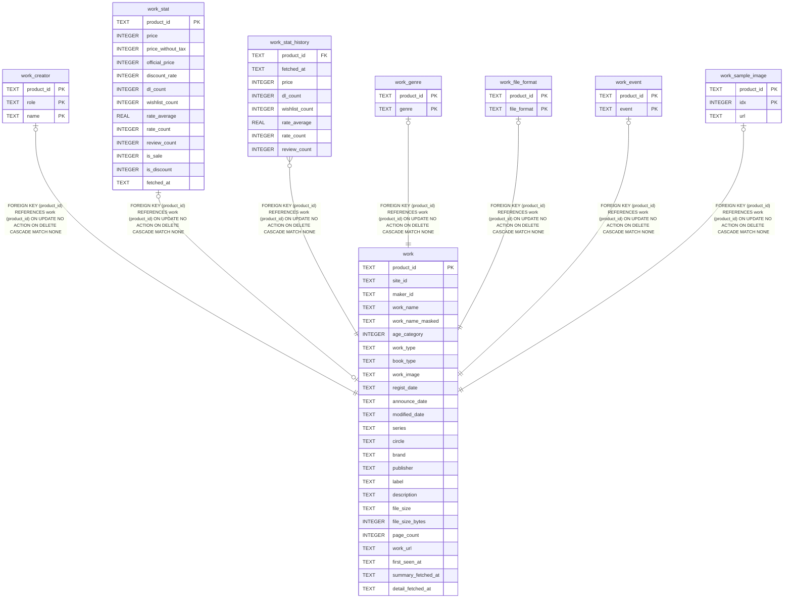

### work_genre

#### Description

<details>
<summary><strong>Table Definition</strong></summary>

```sql
CREATE TABLE work_genre (
    product_id text not null references work (product_id) on delete cascade,
    genre      text not null,
    primary key (product_id, genre)
)
```

</details>

#### Columns

| Name | Type | Default | Nullable | Children | Parents | Comment |
| ---- | ---- | ------- | -------- | -------- | ------- | ------- |
| product_id | TEXT |  | false |  | [work](#work) |  |
| genre | TEXT |  | false |  |  |  |

#### Constraints

| Name | Type | Definition |
| ---- | ---- | ---------- |
| product_id | PRIMARY KEY | PRIMARY KEY (product_id) |
| genre | PRIMARY KEY | PRIMARY KEY (genre) |
| - (Foreign key ID: 0) | FOREIGN KEY | FOREIGN KEY (product_id) REFERENCES work (product_id) ON UPDATE NO ACTION ON DELETE CASCADE MATCH NONE |
| sqlite_autoindex_work_genre_1 | PRIMARY KEY | PRIMARY KEY (product_id, genre) |

#### Indexes

| Name | Definition |
| ---- | ---------- |
| work_genre_idx | CREATE INDEX work_genre_idx on work_genre (genre) |
| sqlite_autoindex_work_genre_1 | PRIMARY KEY (product_id, genre) |

#### Relations

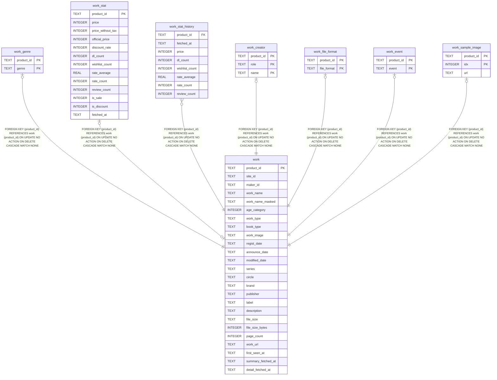

### work_file_format

#### Description

<details>
<summary><strong>Table Definition</strong></summary>

```sql
CREATE TABLE work_file_format (
    product_id  text not null references work (product_id) on delete cascade,
    file_format text not null,
    primary key (product_id, file_format)
)
```

</details>

#### Columns

| Name | Type | Default | Nullable | Children | Parents | Comment |
| ---- | ---- | ------- | -------- | -------- | ------- | ------- |
| product_id | TEXT |  | false |  | [work](#work) |  |
| file_format | TEXT |  | false |  |  |  |

#### Constraints

| Name | Type | Definition |
| ---- | ---- | ---------- |
| product_id | PRIMARY KEY | PRIMARY KEY (product_id) |
| file_format | PRIMARY KEY | PRIMARY KEY (file_format) |
| - (Foreign key ID: 0) | FOREIGN KEY | FOREIGN KEY (product_id) REFERENCES work (product_id) ON UPDATE NO ACTION ON DELETE CASCADE MATCH NONE |
| sqlite_autoindex_work_file_format_1 | PRIMARY KEY | PRIMARY KEY (product_id, file_format) |

#### Indexes

| Name | Definition |
| ---- | ---------- |
| sqlite_autoindex_work_file_format_1 | PRIMARY KEY (product_id, file_format) |

#### Relations

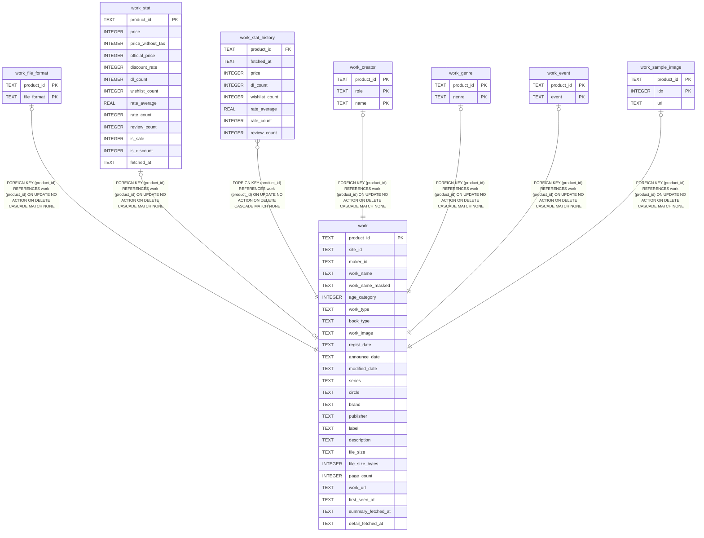

### work_event

#### Description

<details>
<summary><strong>Table Definition</strong></summary>

```sql
CREATE TABLE work_event (
    product_id text not null references work (product_id) on delete cascade,
    event      text not null,
    primary key (product_id, event)
)
```

</details>

#### Columns

| Name | Type | Default | Nullable | Children | Parents | Comment |
| ---- | ---- | ------- | -------- | -------- | ------- | ------- |
| product_id | TEXT |  | false |  | [work](#work) |  |
| event | TEXT |  | false |  |  |  |

#### Constraints

| Name | Type | Definition |
| ---- | ---- | ---------- |
| product_id | PRIMARY KEY | PRIMARY KEY (product_id) |
| event | PRIMARY KEY | PRIMARY KEY (event) |
| - (Foreign key ID: 0) | FOREIGN KEY | FOREIGN KEY (product_id) REFERENCES work (product_id) ON UPDATE NO ACTION ON DELETE CASCADE MATCH NONE |
| sqlite_autoindex_work_event_1 | PRIMARY KEY | PRIMARY KEY (product_id, event) |

#### Indexes

| Name | Definition |
| ---- | ---------- |
| sqlite_autoindex_work_event_1 | PRIMARY KEY (product_id, event) |

#### Relations

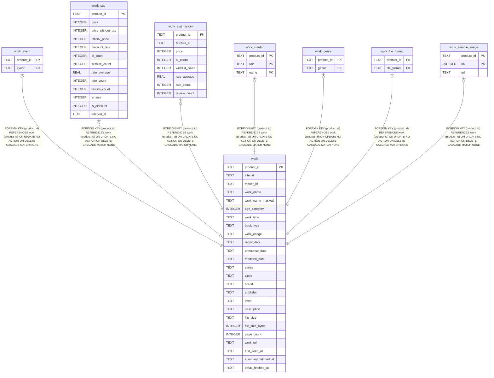

### work_sample_image

#### Description

<details>
<summary><strong>Table Definition</strong></summary>

```sql
CREATE TABLE work_sample_image (
    product_id text not null references work (product_id) on delete cascade,
    idx        integer not null,
    url        text not null,
    primary key (product_id, idx)
)
```

</details>

#### Columns

| Name | Type | Default | Nullable | Children | Parents | Comment |
| ---- | ---- | ------- | -------- | -------- | ------- | ------- |
| product_id | TEXT |  | false |  | [work](#work) |  |
| idx | INTEGER |  | false |  |  |  |
| url | TEXT |  | false |  |  |  |

#### Constraints

| Name | Type | Definition |
| ---- | ---- | ---------- |
| product_id | PRIMARY KEY | PRIMARY KEY (product_id) |
| idx | PRIMARY KEY | PRIMARY KEY (idx) |
| - (Foreign key ID: 0) | FOREIGN KEY | FOREIGN KEY (product_id) REFERENCES work (product_id) ON UPDATE NO ACTION ON DELETE CASCADE MATCH NONE |
| sqlite_autoindex_work_sample_image_1 | PRIMARY KEY | PRIMARY KEY (product_id, idx) |

#### Indexes

| Name | Definition |
| ---- | ---------- |
| sqlite_autoindex_work_sample_image_1 | PRIMARY KEY (product_id, idx) |

#### Relations

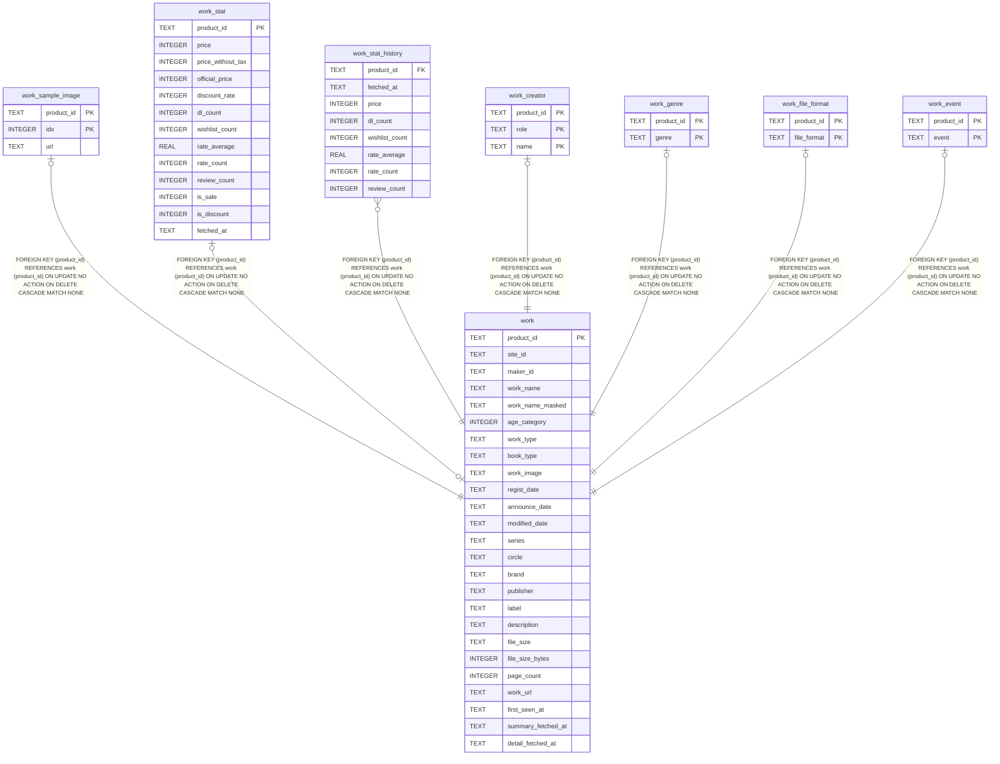

### fetch_error

#### Description

<details>
<summary><strong>Table Definition</strong></summary>

```sql
CREATE TABLE fetch_error (
    product_id      text primary key,
    attempts        integer not null default 0,
    last_error      text,
    last_attempt_at text
)
```

</details>

#### Columns

| Name | Type | Default | Nullable | Children | Parents | Comment |
| ---- | ---- | ------- | -------- | -------- | ------- | ------- |
| product_id | TEXT |  | true |  |  |  |
| attempts | INTEGER | 0 | false |  |  |  |
| last_error | TEXT |  | true |  |  |  |
| last_attempt_at | TEXT |  | true |  |  |  |

#### Constraints

| Name | Type | Definition |
| ---- | ---- | ---------- |
| product_id | PRIMARY KEY | PRIMARY KEY (product_id) |
| sqlite_autoindex_fetch_error_1 | PRIMARY KEY | PRIMARY KEY (product_id) |

#### Indexes

| Name | Definition |
| ---- | ---------- |
| sqlite_autoindex_fetch_error_1 | PRIMARY KEY (product_id) |

#### Relations

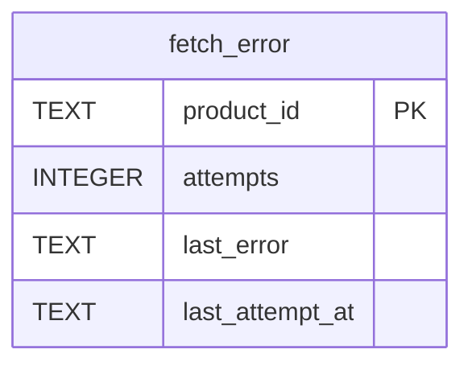

### crawl_state

#### Description

<details>
<summary><strong>Table Definition</strong></summary>

```sql
CREATE TABLE crawl_state (
    key   text primary key,
    value text
)
```

</details>

#### Columns

| Name | Type | Default | Nullable | Children | Parents | Comment |
| ---- | ---- | ------- | -------- | -------- | ------- | ------- |
| key | TEXT |  | true |  |  |  |
| value | TEXT |  | true |  |  |  |

#### Constraints

| Name | Type | Definition |
| ---- | ---- | ---------- |
| key | PRIMARY KEY | PRIMARY KEY (key) |
| sqlite_autoindex_crawl_state_1 | PRIMARY KEY | PRIMARY KEY (key) |

#### Indexes

| Name | Definition |
| ---- | ---------- |
| sqlite_autoindex_crawl_state_1 | PRIMARY KEY (key) |

#### Relations

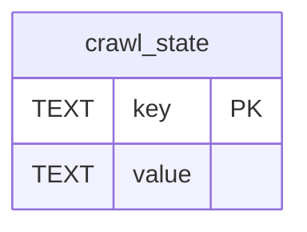

### work_full

#### Description

<details>
<summary><strong>Table Definition</strong></summary>

```sql
CREATE VIEW work_full as
select
    w.*,
    s.price,
    s.dl_count,
    s.wishlist_count,
    s.rate_average,
    s.rate_count,
    s.review_count,
    (select group_concat(c.name, ', ') from work_creator c
      where c.product_id = w.product_id and c.role = 'voice_actor') as voice_actors,
    (select group_concat(c.name, ', ') from work_creator c
      where c.product_id = w.product_id and c.role = 'scenario') as scenarios,
    (select group_concat(c.name, ', ') from work_creator c
      where c.product_id = w.product_id and c.role = 'illustration') as illustrations,
    (select group_concat(g.genre, ', ') from work_genre g
      where g.product_id = w.product_id) as genres
from work w
left join work_stat s on s.product_id = w.product_id
```

</details>

#### Columns

| Name | Type | Default | Nullable | Children | Parents | Comment |
| ---- | ---- | ------- | -------- | -------- | ------- | ------- |
| product_id | TEXT |  | true |  |  |  |
| site_id | TEXT |  | true |  |  |  |
| maker_id | TEXT |  | true |  |  |  |
| work_name | TEXT |  | true |  |  |  |
| work_name_masked | TEXT |  | true |  |  |  |
| age_category | INTEGER |  | true |  |  |  |
| work_type | TEXT |  | true |  |  |  |
| book_type | TEXT |  | true |  |  |  |
| work_image | TEXT |  | true |  |  |  |
| regist_date | TEXT |  | true |  |  |  |
| announce_date | TEXT |  | true |  |  |  |
| modified_date | TEXT |  | true |  |  |  |
| series | TEXT |  | true |  |  |  |
| circle | TEXT |  | true |  |  |  |
| brand | TEXT |  | true |  |  |  |
| publisher | TEXT |  | true |  |  |  |
| label | TEXT |  | true |  |  |  |
| description | TEXT |  | true |  |  |  |
| file_size | TEXT |  | true |  |  |  |
| file_size_bytes | INTEGER |  | true |  |  |  |
| page_count | INTEGER |  | true |  |  |  |
| work_url | TEXT |  | true |  |  |  |
| first_seen_at | TEXT |  | true |  |  |  |
| summary_fetched_at | TEXT |  | true |  |  |  |
| detail_fetched_at | TEXT |  | true |  |  |  |
| price | INTEGER |  | true |  |  |  |
| dl_count | INTEGER |  | true |  |  |  |
| wishlist_count | INTEGER |  | true |  |  |  |
| rate_average | REAL |  | true |  |  |  |
| rate_count | INTEGER |  | true |  |  |  |
| review_count | INTEGER |  | true |  |  |  |
| voice_actors |  |  | true |  |  |  |
| scenarios |  |  | true |  |  |  |
| illustrations |  |  | true |  |  |  |
| genres |  |  | true |  |  |  |

#### Referenced Tables

| Name | Columns | Comment | Type |
| ---- | ------- | ------- | ---- |
| [work_creator](#work_creator) | 3 |  | table |
| [work_genre](#work_genre) | 2 |  | table |
| [work](#work) | 25 |  | table |
| [work_stat](#work_stat) | 13 |  | table |

#### Relations

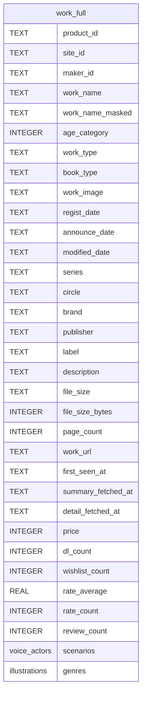

</details>
<!-- tbls:end -->
